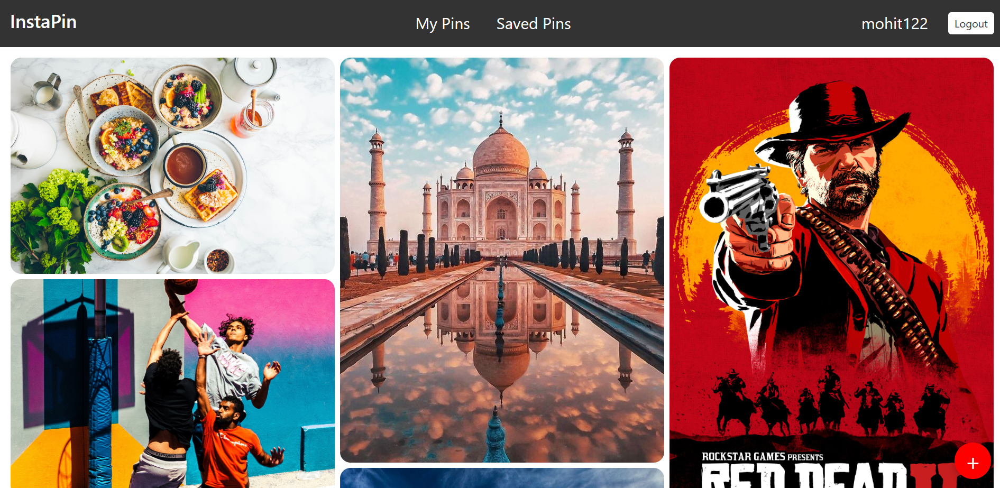
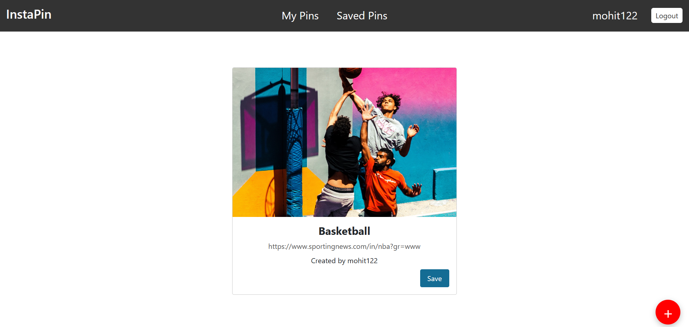
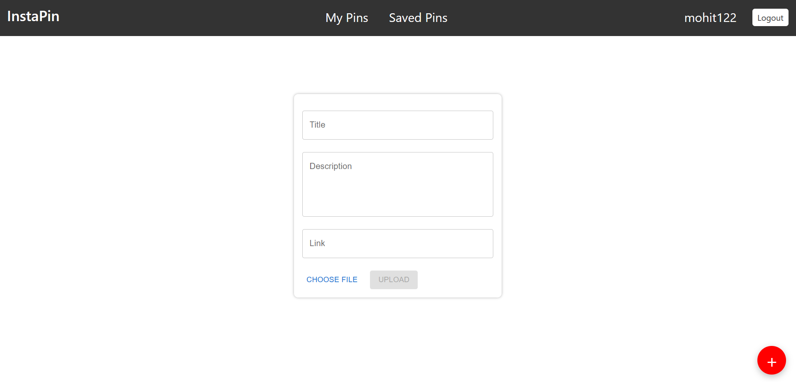

# InstaPin- An Image Sharing Platform

Welcome to InstaPin, my Image Sharing Platform project! This platform is designed to allow users to share and discover images, create pins, and link them to websites. Users can log in, upload images, provide short descriptions, and save pins from other users.

## Tech Stack

The project is built using the following technologies:

- **React**
- **Node.js**
- **JavaScript**
- **MongoDB**
- **Express**
- **GraphQL**

## Features

The image sharing platform offers the following features:

- **User Authentication**: Users can sign up and log in to the platform to access their accounts and perform actions.
- **Pin Creation**: Users can create pins by uploading images and optionally providing a short description.
- **Linking to Websites**: Users can link their pins to external websites to provide additional information.
- **Pin Saving**: Users can save pins created by other users to their profile for later reference.

## Installation

To run the project locally, please follow these steps:

1. Clone the repository to your local machine:

   ```bash
   git clone https://github.com/n0IQ/InstaPin-Backend.git
   ```

2. Install the dependencies for backend:

   ```bash
   npm install
   ```

3. Set up the environment variables:
   Create an .env file in the directory and update the necessary values, such as database connection details and API keys.

4. Start the development server:
   ```
   npm start
   ```
5. Open your web browser and access the backend application at http://localhost:5000/graphql.

## API Documentation

The API documentation for the backend GraphQl queries and mutations for InstaPin can be found in the graphiql docs directory. It provides details on the available GraphQL queries and mutations, along with their input and output structures.

## Project Images




